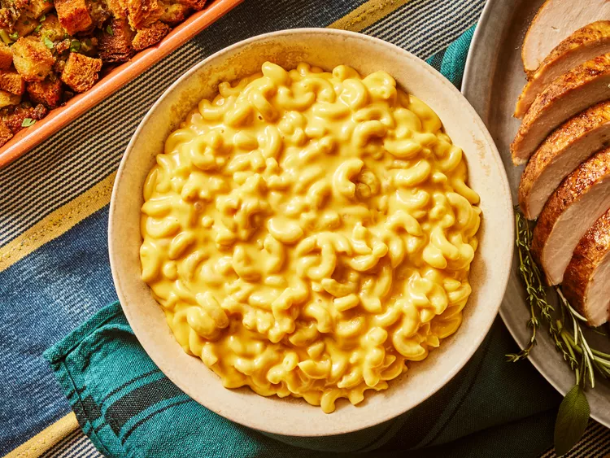

# Chef Hazerin - Comfort food diary (bigger header)

*amazing* recipe (italics)
**ultimate** joy (bold)

## Recipes (smaller header)

- [x] Maccaroni cheese (checklist checked)
- [ ] Spaghetti bolognese (checklist not checked)

## Reasons you should 🌟 the repo!

* For delicious recipes (list)

(alt+96) x3.
This is a code block

``` 
print("Hello world!")
```

(drawing table)
(separate titles to contents the |----|----|)

|Recipe|Date|
|------|-----|
|Mac & cheese| 2024-02-05|
|Spag bowl| 2024-03-03|

### Relevant pictures

1. 
2. [Spag bowl](https://assets.tmecosys.com/image/upload/t_web_rdp_recipe_584x480_1_5x/img/recipe/ras/Assets/b0c32015577868226349e762dccae4a2/Derivates/6d9b634613dcae990d5c23f8daccb4f0200de265.jpg)

Quotation
> The best food i've ever eaten - Gordon Ramsay